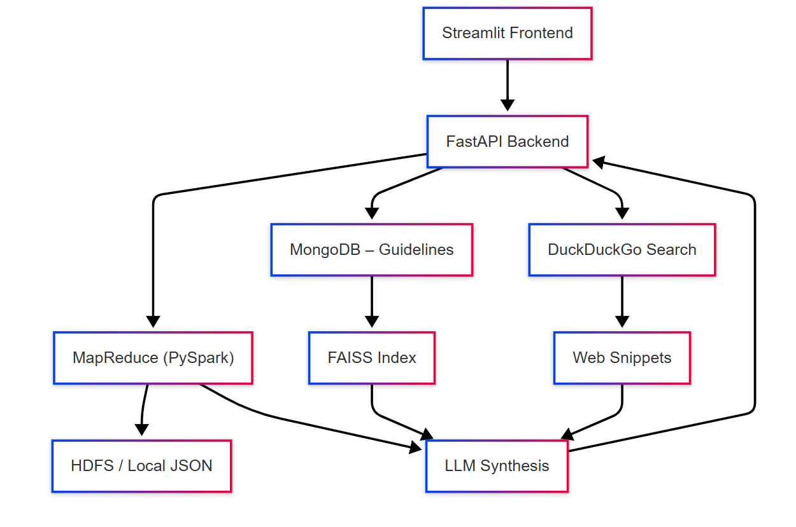

| [](presentation.pptx) | [](rapport.pdf) | [](https://drive.google.com/drive/folders/1n_rqpt91Dw4oS678zjMjuwLsikuRr6J4?usp=sharing) |
|:--:|:--:|:--:|
| **Download Presentation** | **Download Written Report** | **Watch Demo Video** |

# Anxiety QA Platform

## Table of Contents
1. [Overview](#overview)  
2. [Features](#features)  
3. [Architecture](#architecture)  
4. [Getting Started](#getting-started)  
   - [Prerequisites](#prerequisites)  
   - [Installation](#installation)  
   - [Configuration](#configuration)  
5. [Data Ingestion](#data-ingestion)  
   - [Clinical Guidelines](#clinical-guidelines)  
   - [PubMed Papers](#pubmed-papers)  
   - [Tree Generation Utility](#tree-generation-utility)  
6. [Usage](#usage)  
   - [CLI Q&A](#cli-qa)  
   - [FastAPI Backend](#fastapi-backend)  
   - [Streamlit Frontend](#streamlit-frontend)  
7. [Directory Structure](#directory-structure)  
8. [Data Formats](#data-formats)  
9. [Dependencies](#dependencies)  
10. [Contributing](#contributing)  
11. [License](#license)  
12. [Author & Contact](#author--contact)  

---

## Overview
An end-to-end question-answering system for anxiety disorders.  
Combines:  
- PySpark MapReduce retrieval over PubMed abstracts  
- FAISS-backed vector search on clinical guideline snippets in MongoDB  
- DuckDuckGo web snippet lookup  
- LLM-based synthesis (Ollama or OpenAI)  
- FastAPI backend with HDFS support  
- Streamlit frontend for interactive queries  

## Features
- **Data Ingestion**  
  - Scrapes PubMed for “SOTA” vs. legacy reviews  
  - Downloads NICE/WHO PDFs, extracts & embeds text  
- **Retrieval**  
  - Spark SQL ranking by keyword overlap  
  - FAISS similarity search over guideline snippets  
  - DuckDuckGo snippet search  
- **Language Models**  
  - LangChain/Ollama integration with templated fallback  
  - ChatOpenAI (gpt-3.5-turbo) fallback if Ollama unavailable  
- **API & UI**  
  - FastAPI endpoints for job submission/status  
  - Asynchronous background jobs with Spark/HDFS  
  - Streamlit app with dataset info, submission form, polling  

## Architecture
<p align="center">
  
</p>

## Getting Started

### Prerequisites
- Python 3.8+  
- Java 11+  
- Hadoop 3.x (HDFS)  
- Spark 3.x  
- MongoDB 4.x+  
- (Optional) Ollama for local LLMs  
- `.env` file with API keys & paths  

### Installation
```bash
git clone https://github.com/your-org/FD-Project.git
cd FD-Project
python -m venv venv
source venv/bin/activate    # Windows: venv\Scripts\activate
pip install --upgrade pip
pip install -r requirements.txt
```

### Configuration
Create a `.env` file in the project root with:
```env
MONGO_URI=mongodb://localhost:27017
NCBI_API_KEY=your_pubmed_api_key
HADOOP_HOME=/path/to/hadoop
SPARK_HOME=/path/to/spark
JAVA_HOME=/path/to/java
OLLAMA_HOST=localhost
OLLAMA_PORT=11434
```

## Data Ingestion

### Clinical Guidelines
```bash
python dataset/data_ingestion/ingest_anxiety_guidelines.py \
  --mongo "$MONGO_URI" \
  --db anxiety --col guidelines \
  --folder dataset/data_ingestion/guidelines_source
```
- Downloads NICE CG159, CG113, WHO mhGAP PDFs  
- Extracts text via `pdfminer` or `pypdf`  
- Splits into parent (2,000 chars) & child (500 chars) chunks  
- Computes embeddings with `sentence-transformers/all-MiniLM-L6-v2`  
- Upserts into MongoDB with partial unique indexes  

### PubMed Papers
```bash
python dataset/scrapping/pbmed_scraper_psy.py \
  --max-sota 500 --max-legacy 350
```
- Queries Entrez `ESearch` & `EFetch`  
- Parses XML abstracts via `BeautifulSoup`  
- Outputs `dataset/scrapping/anxiety_papers.json`  

### Tree Generation Utility
```bash
python generate_tree.py
```
Produces:
- `dataset/data_ingestion/db_checkout/parent_child_counts.json`  
- `dataset/data_ingestion/db_checkout/parents_with_first_child.json`  

## Usage

### CLI Q&A
```bash
python anxiety_qa_langchain.py \
  --job_id 12345 \
  --question_file path/to/question.txt \
  --dataset_path dataset/scrapping/anxiety_papers.json
```
- MapReduce to retrieve top-10 abstracts  
- LangChain + Ollama/OpenAI for answer  
- Fallback template if LLM fails  
- Writes `results/results_<job_id>.json`  

### FastAPI Backend
```bash
uvicorn app:app --reload --host 0.0.0.0 --port 8000
```
- `POST /submit_question/` → `{ job_id, status }`  
- `GET /job_status/{job_id}` → result or status  
- `GET /recent_jobs/` → last 10 jobs  
- `GET /dataset_info` → HDFS dataset metadata  

### Streamlit Frontend
```bash
streamlit run streamlit_app.py
```
- Interactive Q&A UI  
- Sidebar shows HDFS dataset status  
- Polls backend for job completion  
- Displays question, answer, timing, citations  

## Directory Structure
```text
FD-Project/
├── anxiety_qa_langchain.py        # CLI Spark + LangChain QA
├── app.py                         # FastAPI backend
├── dataset/
│   ├── data_ingestion/
│   │   ├── db_checkout/
│   │   │   ├── MondoDB_architecture.json
│   │   │   ├── child_count.py
│   │   │   ├── first_child.py
│   │   │   ├── parent_child_counts.json
│   │   │   └── parents_with_first_child.json
│   │   ├── guidelines_catalogue.json
│   │   ├── guidelines_source/
│   │   │   ├── NICE_CG159_Social_Anxiety_Disorder.pdf
│   │   │   ├── NICE_Guideline_CG113_Generalised_anxiety_disorder_and_panic_disorder_in_adults_m.pdf
│   │   │   └── WHO_mhGAP_Intervention_Guide_v2.0.pdf
│   │   └── ingest_anxiety_guidelines.py
│   └── scrapping/
│       ├── anxiety_papers.json
│       └── pbmed_scraper_psy.py
├── generate_tree.py               # Tree-generation utility
├── parent_child_counts.json       # Sample counts output (possibly redundant)
├── parent_with_first_child.json   # Sample first-child output (possibly redundant)
├── presentation.pptx              # Slides
├── rapport.pdf                    # Written report
├── requirements.txt               # Python dependencies
├── results/                       # JSON results per job
└── streamlit_app.py               # Streamlit frontend
```

## Data Formats
**`dataset/scrapping/anxiety_papers.json`**  
```json
[
  {
    "pmid": "12345678",
    "title": "...",
    "abstract": "...",
    "journal": "...",
    "year": "2024",
    "authors": ["A. One", "B. Two"]
  }
  …
]
```

**MongoDB guidelines collection**  
Documents with `doc_level`: `"parent"` or `"child"`, plus embeddings.

**Results files**  
`results/results_<job_id>.json`:
```json
{
  "question": "...",
  "answer": "...",
  "error": null,
  "timestamp": "2025-04-30T12:34:56"
}
```

## Dependencies
See `requirements.txt` for:
- fastapi
- uvicorn
- streamlit
- pyspark
- hadoop-client
- pymongo
- sentence-transformers
- langchain
- langchain-ollama
- beautifulsoup4
- pdfminer.six
- pypdf
- faiss-cpu
- duckduckgo-search
- python-dotenv

## Contributing
1. Fork & clone the repository  
2. Create a feature branch:  
   ```bash
   git checkout -b feat/xyz
   ```  
3. Install & run tests (if any)  
4. Submit a PR with a clear description & tests  

## License
This project is licensed under the MIT License. See [LICENSE](LICENSE).

## Author & Contact
**Your Name**  
GitHub: [@BSHLoussama](https://github.com/BSHLoussama)  
Email: oussamaboussahla2017@gmail.com  
